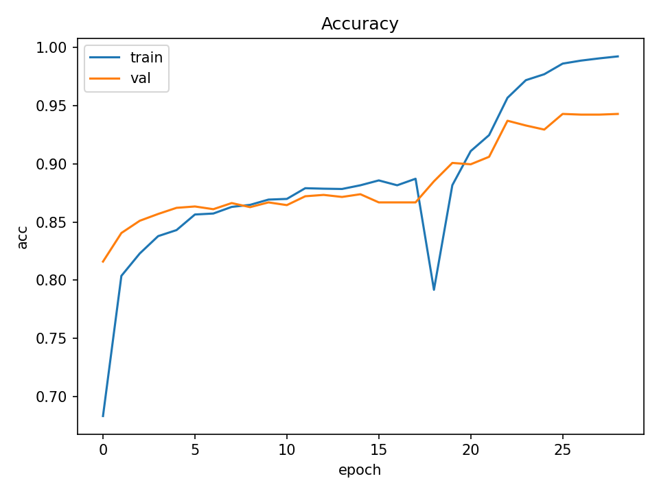
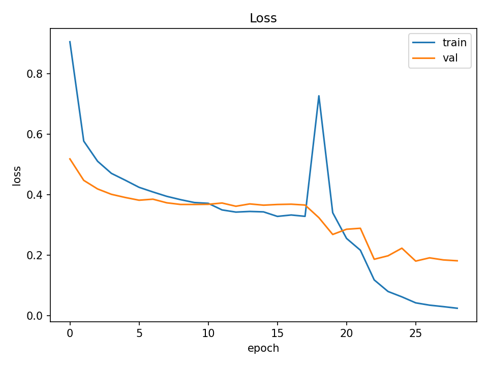
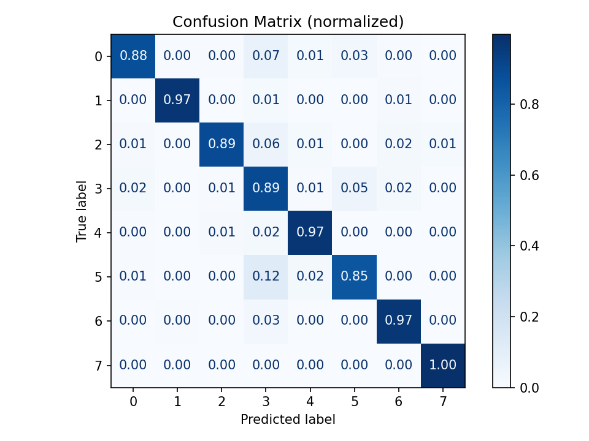
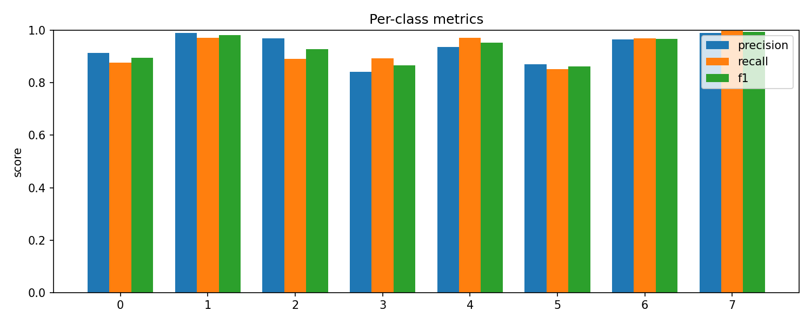
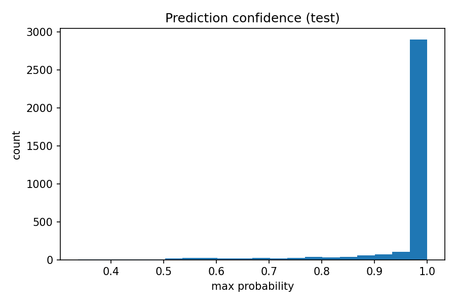

# BloodMNIST Classification with MobileNetV2

## Overview
โปรเจกต์นี้เป็น **Computer Vision Starter** สำหรับงานจำแนกเซลล์เลือด (Blood Cell Classification) โดยใช้ชุดข้อมูล [BloodMNIST](https://medmnist.com/) และโมเดล **MobileNetV2** (pretrained on ImageNet) พร้อม pipeline เต็มรูปแบบตั้งแต่โหลดข้อมูล, เตรียมชุดข้อมูล, เทรนโมเดล, ประเมินผล, และสร้างกราฟสรุปผลการเรียนรู้

จุดประสงค์:
- สร้าง pipeline ที่ reproducible และนำไปต่อยอดได้ง่าย
- ทดสอบแนวทางการใช้ transfer learning + fine-tuning บนงาน Medical Image Classification
- เก็บผลและ artifacts ไว้ครบในโครงสร้างโฟลเดอร์

---
```plaintext
cv-starter/
├── configs/
│   └── default.yaml          
├── results/
│   ├── metrics/
│   │   ├── summary.json
│   │   └── class_report.json
│   ├── models/
│   │   ├── best_mnv2.h5
│   │   └── bloodmnist_mnv2.h5
│   └── plots/
│       ├── acc_curve.png
│       ├── loss_curve.png
│       ├── confusion_matrix.png
│       ├── confusion_matrix_norm.png
│       ├── per_class_metrics.png
│       └── confidence_hist.png
├── src/
│   └── cv_starter/
│       ├── __init__.py
│       ├── data.py
│       ├── model.py
│       ├── train.py
│       └── eval.py
├── tests/
│   └── test_sanity.py
└── README.md  
```
## Workflow

### 1. Data Preparation
- ใช้ **BloodMNIST** (training/validation/test sets)
- แปลงภาพจาก 28×28 → 224×224 pixels เพื่อให้เข้ากับ MobileNetV2
- Augmentation: random flip, brightness, contrast, saturation
- Class weights คำนวณจาก distribution ของ training set เพื่อลดผล imbalance

### 2. Model Architecture
- Base: **MobileNetV2** (ImageNet pretrained, include_top=False)
- GlobalAveragePooling + Dropout(0.2)
- Dense softmax output (`dtype='float32'` เพื่อรองรับ mixed precision)
- Mixed precision training (float16 compute)

### 3. Training Strategy
- Stage 1: Train เฉพาะ head layers (base frozen)
- Stage 2 (optional): Fine-tune โดย unfreeze 60 layers สุดท้ายใน backbone
- Optimizer: Adam
- Loss: SparseCategoricalCrossentropy (with class weights)
- Callbacks: EarlyStopping, ReduceLROnPlateau, ModelCheckpoint
- Metrics: Accuracy

### 4. Evaluation
- ใช้โมเดลที่ดีที่สุด (`best_mnv2.h5`)
- สร้าง:
  - Accuracy/Loss curves
  - Confusion matrix (count & normalized)
  - Per-class precision/recall/F1 bar chart
  - Confidence histogram
- Export JSON:
  - `summary.json` (test loss & accuracy)
  - `class_report.json` (per-class metrics)

---

## Results

**Test Accuracy:** **93.74%**  
**Macro F1-score:** **0.931**

| Class | Precision | Recall | F1-score | Support |
|-------|-----------|--------|----------|---------|
| 0     | 0.9145    | 0.8770 | 0.8954   | 244     |
| 1     | 0.9902    | 0.9712 | 0.9806   | 624     |
| 2     | 0.9685    | 0.8907 | 0.9280   | 311     |
| 3     | 0.8407    | 0.8929 | 0.8660   | 579     |
| 4     | 0.9365    | 0.9712 | 0.9535   | 243     |
| 5     | 0.8705    | 0.8521 | 0.8612   | 284     |
| 6     | 0.9642    | 0.9700 | 0.9671   | 666     |
| 7     | 0.9895    | 0.9979 | 0.9936   | 470     |
| **Avg (macro)** | **0.9343** | **0.9279** | **0.9307** | **3421** |

---

## Example Plots

### Accuracy & Loss Curves
  
  

### Confusion Matrix
  

### Per-Class Metrics
  

### Prediction Confidence
  

---
## สรุปผลการทดลอง

การทดลองจำแนกประเภทเซลล์เลือดจากชุดข้อมูล **BloodMNIST** ด้วยโมเดล **MobileNetV2** แบบ Transfer Learning และ Fine-tuning ให้ผลลัพธ์ที่มีประสิทธิภาพสูงบนชุดทดสอบ

- **ความแม่นยำ (Test Accuracy):** **93.74%**
- **ค่า Macro F1-score:** **0.931**
- **ค่า Weighted F1-score:** **0.938**
- **ขนาดโมเดล:** ประมาณ 14 MB (ไฟล์ checkpoint ที่ดีที่สุด)
- **กลยุทธ์การฝึก:** 2 ขั้นตอน (ฝึกเฉพาะหัวโมเดล → Fine-tune 60 เลเยอร์สุดท้ายของ backbone)
- **การทำ Augmentation:** พลิกรูปแบบสุ่ม, ปรับความสว่าง, ความคอนทราสต์, และความอิ่มสี
- **การใช้ Class Weights:** เพื่อปรับสมดุลข้อมูลที่ไม่สมดุลระหว่างคลาส

### ข้อสังเกตสำคัญ:
- ส่วนใหญ่แต่ละคลาสได้ **F1-score > 0.93** แสดงถึงความสามารถที่สมดุลในการจำแนก
- คลาส **3** ได้ F1-score ต่ำสุด (0.866) เนื่องจาก recall ต่ำกว่า (0.893) อาจพัฒนาได้ด้วยการทำ augmentation เฉพาะคลาสหรือเพิ่มรอบการฝึก
- คลาส **1** และ **7** มีผลลัพธ์เกือบสมบูรณ์แบบ (F1 ~ 0.98–0.99)
- โมเดลสามารถ generalize ได้ดี ไม่มี overfitting รุนแรง — กราฟ training และ validation ใกล้กันตลอด

### แนวทางพัฒนาต่อ:
- ทดลอง MobileNetV2 ขนาดใหญ่ขึ้น (`alpha=1.4`) หรือ backbone อื่น เช่น EfficientNet-B0/B3 เพื่อเพิ่มความแม่นยำ
- ใช้เทคนิคอธิบายการตัดสินใจของโมเดล เช่น Grad-CAM เพื่อดูบริเวณที่โมเดลให้ความสำคัญ
- แปลงโมเดลเป็น TFLite เพื่อใช้งานบนอุปกรณ์มือถือหรือ edge device
## How to Run

```bash
# Train
python -m cv_starter.train --config configs/default.yaml

# Evaluate
python -m cv_starter.eval --config configs/default.yaml --model results/models/best_mnv2.h5
```

